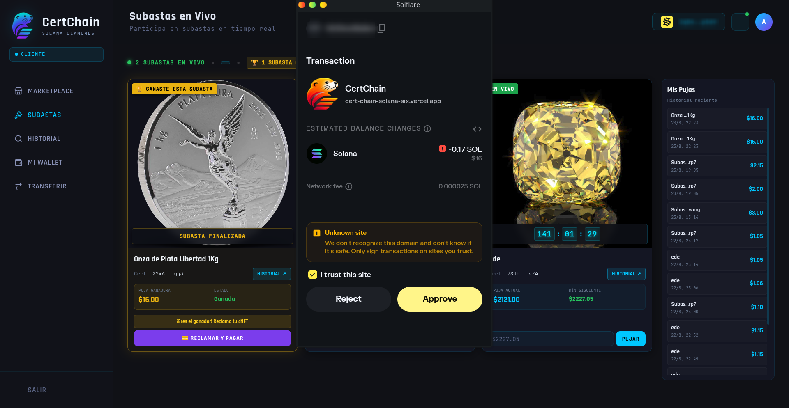
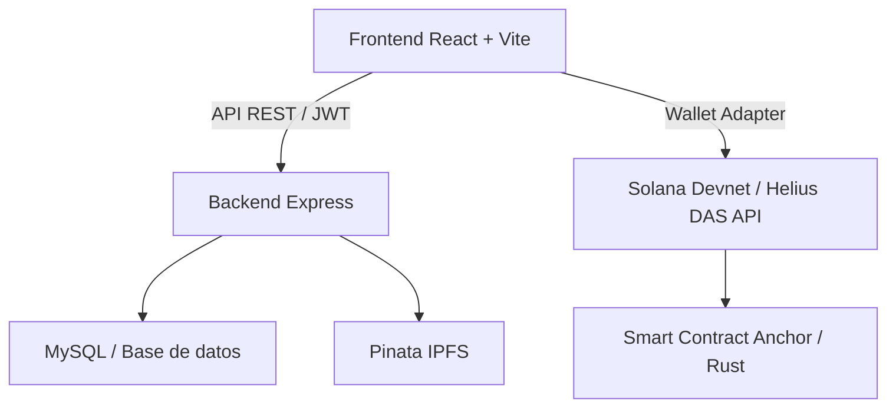

<div align="center">


# SOLANA Diamonds

### Certificación, trazabilidad y comercio de productos mediante cNFTs en Solana

</div>

---

## Descripción general

**SOLANA Diamonds** es una plataforma Web3 para la **certificación, trazabilidad, validación y comercialización** de productos mediante **cNFTs (Compressed NFTs)** sobre la red de **Solana**.

El sistema está diseñado para que empresas, coleccionistas, distribuidores y compradores puedan certificar la autenticidad de un producto, verificar su historial de propiedad y realizar transferencias o subastas de forma segura mediante la blockchain.



El proyecto combina una arquitectura híbrida:

- 🔒 **Off-chain**: autenticación de usuarios, reglas del negocio, gestión de transacciones y almacenamiento relacional.
- ⛓️ **On-chain**: lógica de validación, emisión de certificados y trazabilidad basada en el smart contract de Solana.

---

## ¿Qué problema resuelve?

Muchas industrias necesitan certificar de forma confiable la procedencia, autenticidad y trazabilidad de un producto. Con Solana y cNFTs, el proyecto permite:

- emitir certificados digitales únicos y verificables,
- vincular cada certificado a un producto real,
- evitar falsificaciones mediante evidencia on-chain,
- registrar cambios de propietario y custodia,
- facilitar transacciones, subastas y marketplace interno.

---

## Arquitectura del sistema



---

## Stack tecnológico

| Capa | Tecnología |
| --- | --- |
| Frontend | React, Vite, TypeScript, Tailwind CSS |
| Blockchain | Solana, Web3.js, Anchor, Wallet Adapter |
| NFTs comprimidos | Metaplex Bubblegum, Umi, cNFTs |
| Backend | Node.js, Express, MySQL |
| Almacenamiento digital | Pinata IPFS |
| Validación | JWT, middleware express, reglas de negocio personalizadas |

---

## Funcionalidades principales

### Módulo empresa / emisor

- Emisión de certificados digitales en formato cNFT.
- Asociación de certificados con imágenes, metadatos y atributos del producto.
- Generación de códigos QR para verificación física.
- Creación y administración de subastas.
- Transferencias directas entre wallets.
- Visualización y administración del inventario de certificados emitidos.
- Verificación de autenticidad y estado del certificado en la blockchain.

### Módulo cliente / comprador

- Consulta de certificados en su wallet conectada.
- Compra directa en marketplace.
- Participación en subastas.
- Historial de trazabilidad y custodia.
- Reventa o transferencia a otras wallets.
- Verificación de autenticidad en tiempo real.

---

## Flujo de trabajo

1. La empresa crea un certificado para un producto y sube su imagen y metadatos.
2. El backend procesa el contenido y lo publica en IPFS a través de Pinata.
3. Se emite el cNFT asociado al certificado sobre Solana.
4. El comprador o cliente recibe el token en su wallet.
5. Cualquier persona puede verificar la autenticidad del producto consultando la blockchain y el historial asociado.

---

## Estructura del proyecto

```text
.
├── backend/                  # API backend en Node.js + Express
│   ├── idl/                  # archivos del smart contract y utilidades
│   ├── uploads/              # almacenamiento local de imágenes
│   ├── server.js             # servidor principal
│   ├── pinataService.js      # integración con Pinata
│   ├── auctionBidRules.js    # reglas de subasta
│   └── package.json
├── public/                   # recursos públicos y assets
├── services/                 # servicios auxiliares
├── src/                      # frontend React/Vite
├── smartContract.rs          # lógica del contrato smart contract
├── package.json              # dependencias del frontend
├── vite.config.ts
├── tsconfig.json
├── vercel.json
├── index.html
├── README.md
└── .gitignore
```

---

## Requisitos previos

- Node.js 18+
- pnpm
- Cuenta de Solana con wallet compatible (Phantom, Solflare, etc.)
- Acceso a una RPC de Solana (Helius o equivalente)
- Cuenta Pinata para subir metadatos e imágenes a IPFS
- Base de datos MySQL (si se usa la parte off-chain del backend)

---

## Instalación y ejecución local

### 1) Clonar el repositorio

```bash
git clone https://github.com/aldairugalde754-dotcom/SOLANA-Diamonds.git
cd SOLANA-Diamonds
```

### 2) Instalar dependencias

```bash
pnpm install
```

### 3) Instalar dependencias del backend

```bash
cd backend
pnpm install
cd ..
```

### 4) Ejecutar frontend

```bash
pnpm run dev
```

### 5) Ejecutar backend

```bash
cd backend
pnpm run dev
```

---


## Roadmap futuro

- [ ] Mejorar la UX para usuarios no técnicos en Web3.
- [ ] Integración con login social y creación automática de wallets.
- [ ] Expansión del marketplace y soporte para venta secundaria.
- [ ] Optimización de trazabilidad con eventos y auditaría más amigable.
- [ ] Mejoras en QR, seguimiento y validación de certificados físicos.
- [ ] Soporte móvil y experiencia de verificación desde cámara.
- [ ] Nuevos módulos empresariales para tiendas, distribuciones y gestión de inventario.

---