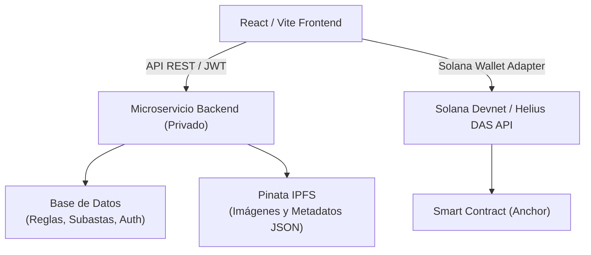

<div align="center">


 # CertChai --- SOLANA Diamonds

### Certificación, trazabilidad mediante cNFTs en Solana

</div>

---

## 📖 Descripción

**CertChain** es una plataforma Web3 integral diseñada para la **certificación, trazabilidad, comercio y subasta** de certificados de autenticidad para diferente productos, mediante **cNFTs (Compressed NFTs)** sobre la red de **Solana (Devnet)**.

El proyecto combina una arquitectura híbrida:

- 🔒 **Off-Chain** — Gestion de usuarios y validacion de las tranzacciones mediante MySQL.
- ⛓️ **On-Chain** — Logica Solida del proyecto mediante un SmartContract de SOLANA para las operaciones, validaciones y creacion de los cNFTS.

## 🏗️ Arquitectura del sistema



### 🧰 Stack tecnológico

| Capa | Tecnologías |
|---|---|
| **Frontend** | React + Vite + Tailwind CSS + Solana Wallet Adapter |
| **Blockchain & Web3** | Solana Devnet + Helius DAS API + Anchor Framework (Rust) |
| **Almacenamiento descentralizado** | Pinata IPFS SDK y metadatos JSON dinámicos estándar Metaplex) |

---

## 👥 Funcionalidades por rol de usuario

### 🏢 Módulo Empresa (Emisores )

- ✨ **Emisión de cNFTs dinámicos** — generación de certificados comprimidos vinculando imágenes del producto y metadatos JSON, subidos automáticamente a Pinata IPFS.
- 🗃️ **Almacenamiento de cNFTs** — panel para visualizar y gestionar la colección de certificados emitidos.
- 📱 **Generación de código QR de verificación** — creación de QR para adjuntar físicamente a las piezas, permitiendo autenticación instantánea.
- 🔨 **Creación de subastas** — configuración de precio base, incrementos mínimos y tiempos de finalizacion.
- 🔁 **Transferencias directas (P2P)** — envíos seguros de certificados a wallets de clientes tras ventas privadas o en tienda física.
- ✅ **Verificación de autenticidad** — auditoría del estado del cNFT en tiempo real sobre la blockchain.

### 👤 Módulo Cliente / Coleccionista

- 🗄️ **Bóveda personal de certificados** — visualización de la propiedad de piezas en la wallet conectada.
- 🛒 **Compra directa en marketplace** — adquisición de certificados mediante firma de transacciones en Solana.
- 🏷️ **Participación en subastas** — pujas en tiempo real, ofertas e historial actualizado.
- 🔍 **Historial con cadena de custodia** — explorador visual de trazabilidad: transferencias anteriores, timestamps y dueños previos.
- 💱 **Reventa en marketplace** — listado de piezas certificadas en el mercado secundario.
- 🔁 **Transferencias P2P** — envío directo de certificados a otras wallets.

---

## 📦 Almacenamiento descentralizado con Pinata IPFS

La plataforma utiliza **Pinata** para garantizar que los activos digitales de cada certificado permanezcan inmutables y accesibles de forma descentralizada:

1. **Procesamiento de imágenes** — las fotografías en alta definición se suben al cluster de IPFS, generando un *Content Identifier* (CID) único.
2. **Generación de metadatos JSON dinámicos** — se construye un archivo JSON conforme al estándar **Metaplex**, incluyendo atributos del producto.
3. **Vinculación on-chain** — la URI devuelta por Pinata (`ipfs://...`) se inscribe permanentemente en la estructura del cNFT durante la acuñación en Solana.

---

## 🛠️ Variables de entorno (Frontend)

Crea un archivo `.env` en la raíz del proyecto:

```env
VITE_API_BASE_URL= Base URL Vercel
VITE_SOLANA_RPC_URL= Api de Helius
VITE_DAS_RPC=https: DAS API Helius
```

---

## ⚡ Instalación y ejecución local

**1. Clonar el repositorio**

```bash
git clone https://github.com/aldairugalde754-dotcom/CertChain-SOLANA.git
cd CertChain-SOLANA
```

**2. Instalar dependencias con PNPM**

```bash
pnpm install
```

**3. Iniciar el servidor de desarrollo**

```bash
pnpm run dev
```

---

## 🔮 Roadmap futuro

- [ ] Hacer una versión en app móvil para facilitar el uso de la cámara en verificaciones de códigos y transacciones rápidas.
- [ ] Mayor usabilidad en creación de cuentas integrando login con cuentas de google y creación automática de la Wallet.
- [ ] Oculamentieno y protocolo de enlaces para los merkle Trees
- [ ] Códigos QR para direcciones de wallet, con ello integrar las transferencias mediante los QR.
- [ ] Darle acceso a los usuarios para poder realizar subastas
- [ ] Mayor desarrollo en los datos de las empresas para desarrollar tiendas en línea dentro de la plataforma para cada empresa.
- [ ] Disminuir la interacción con términos de blockchain desconocidos para el usuario común para ofrecer mayor usabilidad.


---

<div align="center">

</div>
